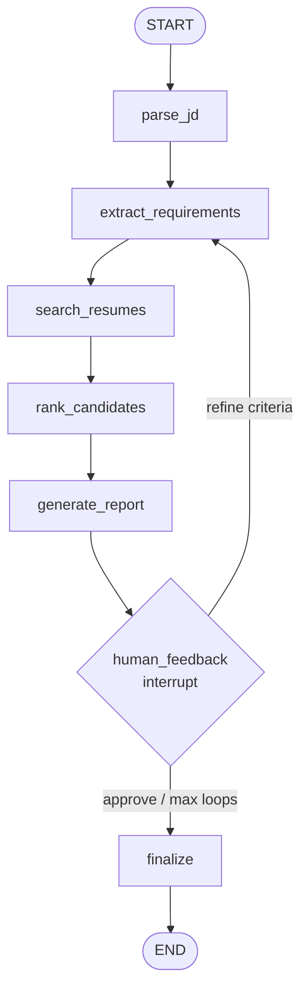
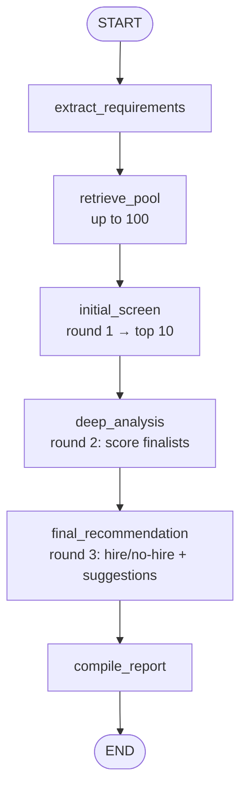

# Agentic Profile Matching

> An enterprise-grade, **LangGraph**-based agent that matches candidate resumes to
> job descriptions using retrieval-augmented generation (RAG) and **Claude** —
> with a human-in-the-loop refinement workflow, a conversational interface, and a
> multi-round screening pipeline with explainable hire/no-hire recommendations.

This repository implements **Part A (Agent Architecture)**, **Part B (Interactive
Features)**, and **Part C (Advanced Capabilities)** of the assignment, end-to-end
and production-ready.

---

## Table of contents

- [Requirements (the brief)](#requirements-the-brief)
- [Features](#features)
- [Architecture at a glance](#architecture-at-a-glance)
- [State machines](#state-machines)
- [Quick start](#quick-start)
- [Usage](#usage)
- [Configuration](#configuration)
- [Testing](#testing)
- [Documentation](#documentation)
- [Requirement → implementation map](#requirement--implementation-map)

---

## Requirements (the brief)

### Part A: Agent Architecture (40%)

Create `matching_agent.py` using **LangGraph**:

- **Agent State Design** — track conversation history; maintain job-requirements
  understanding; store candidate shortlist and reasoning.
- **Agent Workflow (Graph Structure)** —
  `START → Parse JD → Extract Requirements → Search Resumes → Rank Candidates → Generate Report → Human Feedback Loop → END`.
- **Tools Available to Agent** — all file-system tools (Milestone 1); RAG search
  tool (Milestone 2); `extract_requirements(jd)`, `compare_candidates(candidate_ids)`,
  `generate_interview_questions(candidate_id)`.

### Part B: Interactive Features (30%)

- **Conversational Interface** — accept natural-language queries (*"Find me
  candidates with React and 3+ years"*, *"Compare the top 3 side by side"*,
  *"Why did John rank higher than Jane?"*).
- **Iterative Refinement** — adjust requirements mid-conversation; the agent
  re-ranks on the new criteria and explains the changes.

### Part C: Advanced Capabilities (30%)

- **Multi-Round Screening** — initial screen (top 10 from 100 resumes) → second
  round (deep analysis of the top 10) → final round (hire/no-hire recommendation).
- **Explainability** — detailed match reports; strengths and gaps per candidate;
  improvement suggestions for borderline candidates.

### Submission Guidelines

LangGraph-based agent implementation; state-machine diagram; chat interface (CLI
or Streamlit/Gradio); 5+ conversation-flow test scenarios; demo video.

---

## Features

**Part A — Agent Architecture**

- A LangGraph state machine implementing the required workflow exactly
  (`agent/graph.py` + `agent/nodes.py`).
- Typed **agent state** (`models/state.py`) tracking conversation history, the
  job-requirements understanding, and the candidate shortlist with reasoning.
- Full tool surface: sandboxed file-system tools, a RAG search tool,
  `extract_requirements`, `compare_candidates`, `generate_interview_questions`.

**Part B — Interactive Features**

- A **conversational ReAct agent** (`agent/conversation.py`) answering NL queries.
- **Iterative refinement**: adjust criteria mid-conversation; re-rank + explain.
- Two front-ends: a **Rich CLI** and a **Streamlit** web UI.

**Part C — Advanced Capabilities**

- A **multi-round screening** graph (`agent/screening.py`):
  round 1 fast-triages up to 100 resumes to a top-10 shortlist; round 2 deeply
  analyses each finalist; round 3 issues a hire / no-hire / borderline decision.
- **Explainability**: a detailed Markdown report with per-candidate strengths,
  gaps, must-have coverage, and **improvement suggestions for borderline
  candidates**.

---

## Architecture at a glance

```
        Interfaces                 Orchestration                    Knowledge
  ┌────────────────────┐    ┌────────────────────────────┐   ┌────────────────────┐
  │ Rich CLI            │    │ Matching graph (A)         │   │ Chroma vector store │
  │ Streamlit UI        │───▶│  state machine + HITL      │──▶│  (resume embeddings)│
  │                     │    │ Conversational agent (B)   │   │ sentence-transformers│
  │                     │    │  ReAct + tools             │   └────────────────────┘
  │                     │    │ Screening graph (C)        │
  │                     │    │  3 rounds + explainability  │
  └────────────────────┘    └────────────┬───────────────┘
                                          │
                              services.py (single LLM seam)
                                          │
                                 Claude (Opus 4.8)
                                via langchain-anthropic
```

See [`ARCHITECTURE.md`](docs/ARCHITECTURE.md), [`HLD.md`](docs/HLD.md), and [`LLD.md`](docs/LLD.md).

---

## State machines

### Part A — matching graph (with human-in-the-loop)



### Part C — multi-round screening graph



The Part-A `human_feedback` node uses LangGraph's `interrupt` primitive: the
graph pauses, surfaces the shortlist, and resumes with the hiring manager's
feedback (re-rank on new criteria, or approve to finish).

---

## Quick start

> Requires Python 3.10+ and an Anthropic API key.

```bash
# 1. Create and activate a virtual environment
python -m venv .venv
source .venv/bin/activate          # Windows: .venv\Scripts\activate

# 2. Install
pip install -r requirements.txt
pip install -e .

# 3. Configure
cp .env.example .env               # then edit .env and set ANTHROPIC_API_KEY

# 4. Seed sample data (100 resumes) and build the resume index
python -m scripts.generate_sample_data       # or: make seed   (defaults to 100)
python -m scripts.ingest                      # or: make ingest

# 5. Run
python -m profile_matching.cli.chat           # CLI   (or: make chat)
streamlit run src/profile_matching/app/streamlit_app.py   # Web UI (or: make ui)
```

The repository ships with static sample resumes/JDs in `data/`, so step 4's
generator is optional — but you must still run `ingest` to build the index. For
the Part-C "100 resumes" scale, run the generator (`make seed`).

---

## Usage

### Conversational CLI

```text
you> Find candidates with React and 3+ years of experience
you> Compare the top 2 side by side for a senior frontend role
you> Why does Alice rank higher than Bob?
you> /pipeline data/jobs/frontend_react_role.txt   # Part A: match + human feedback
you> /screen   data/jobs/frontend_react_role.txt   # Part C: multi-round screening
```

`/pipeline` runs the structured matching graph and pauses for your feedback
(enter refined criteria to re-rank, or `approve` to finish). `/screen` runs the
three-round screening and prints the explainable report. The conversational
agent can also invoke screening directly: *"Run a full screening for this JD: …"*.

### Batch / non-interactive

```bash
python -m scripts.run_pipeline  data/jobs/frontend_react_role.txt   # Part A
python -m scripts.run_screening data/jobs/frontend_react_role.txt   # Part C
```

---

## Configuration

All configuration is environment-driven (see [`.env.example`](.env.example)).

| Variable | Default | Purpose |
|---|---|---|
| `ANTHROPIC_API_KEY` | — | **Required.** Claude API key. |
| `APM_LLM_MODEL` | `claude-opus-4-8` | Claude model id. |
| `APM_LLM_EFFORT` | `high` | Reasoning effort (`low`/`medium`/`high`/`max`). |
| `APM_EMBEDDING_MODEL` | `sentence-transformers/all-MiniLM-L6-v2` | Local embeddings. |
| `APM_RETRIEVAL_TOP_K` | `10` | First-pass candidate pool size (matching). |
| `APM_MAX_REFINEMENT_LOOPS` | `5` | Human-in-the-loop iteration cap. |
| `APM_SCREEN_POOL_SIZE` | `100` | Round-1 retrieval pool ("from 100"). |
| `APM_SCREEN_SHORTLIST_SIZE` | `10` | Round-1 shortlist ("top 10"). |
| `APM_BORDERLINE_LOW` / `APM_BORDERLINE_HIGH` | `50` / `70` | Borderline score band. |

---

## Testing

```bash
pip install -e ".[dev]"
pytest                 # or: make test
```

The suite includes **8 conversation-flow scenarios** (covering Parts A, B, and
C) plus unit/integration tests for the domain models, the sandboxed file-system
tools, RAG ingestion, the matching state machine, and the multi-round screening
graph. Tests stub the LLM and vector store, so they run offline without an API
key.

---

## Documentation

| Document | Contents |
|---|---|
| [`docs/ARCHITECTURE.md`](docs/ARCHITECTURE.md) | System architecture, components, data flow, decisions. |
| [`docs/HLD.md`](docs/HLD.md) | High-level design. |
| [`docs/LLD.md`](docs/LLD.md) | Low-level design (modules, classes, state, contracts). |
| [`docs/IMPLEMENTATION_PLAN.md`](docs/IMPLEMENTATION_PLAN.md) | Phased delivery plan and status. |
| [`docs/PROJECT_STRUCTURE.md`](docs/PROJECT_STRUCTURE.md) | Package/file hierarchy. |

---

## Requirement → implementation map

### Part A: Agent Architecture (40%)

| Requirement | Where |
|---|---|
| LangGraph agent | `agent/graph.py` + `agent/nodes.py` |
| State: conversation history | `models/state.py` (`messages`, `add_messages`) |
| State: job-requirements understanding | `models/state.py` (`requirements`) |
| State: shortlist + reasoning | `models/state.py` (`candidates`, `report`) |
| Workflow graph (required node sequence) | `agent/graph.py` |
| File-system tools (Milestone 1) | `tools/filesystem.py` |
| RAG search tool (Milestone 2) | `tools/rag_search.py` + `rag/` |
| `extract_requirements(jd)` | `tools/requirements.py` |
| `compare_candidates(ids)` | `tools/comparison.py` |
| `generate_interview_questions(id)` | `tools/interview.py` |

### Part B: Interactive Features (30%)

| Requirement | Where |
|---|---|
| Conversational interface (NL queries) | `agent/conversation.py`, `cli/chat.py`, `app/streamlit_app.py` |
| Iterative refinement + re-rank + explain | `agent/conversation.py` + Part-A feedback loop |

### Part C: Advanced Capabilities (30%)

| Requirement | Where |
|---|---|
| Multi-round screening (initial → deep → final) | `agent/screening.py` (round nodes) |
| Initial screen: top 10 from 100 | `services.initial_screen` + `APM_SCREEN_*` |
| Deep analysis of top 10 | `services.rank_candidates` (round 2 node) |
| Hire/no-hire recommendation | `services.final_recommendations` (round 3 node) |
| Detailed match reports | `ScreeningReport.render_markdown()` |
| Strengths & gaps per candidate | `CandidateScore` (strengths/gaps/must-have) |
| Improvement suggestions (borderline) | `FinalAssessment.improvement_suggestions` |
| Exposed as a tool | `tools/screening.py` (`screen_candidates`) |

### Submission guidelines

| Item | Where |
|---|---|
| LangGraph-based implementation | `agent/` |
| State-machine diagrams | This README ([State machines](#state-machines)) + `docs/ARCHITECTURE.md` |
| Chat interface (CLI + Streamlit) | `cli/chat.py`, `app/streamlit_app.py` |
| 5+ conversation-flow test scenarios | `tests/scenarios/test_conversation_flows.py` (8 flows) |
